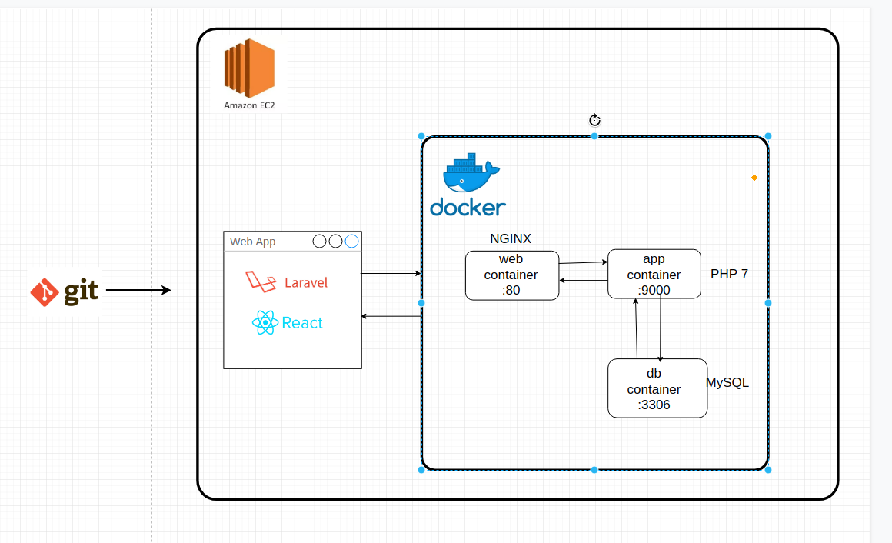
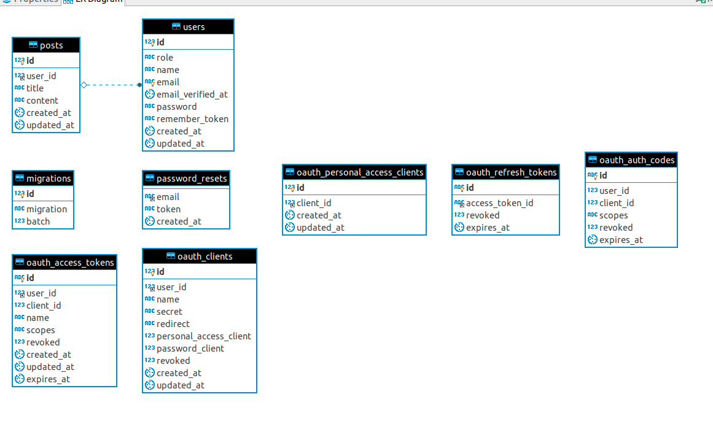
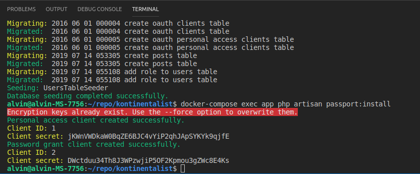

# Kontinentalist Full Stack Developer Test - Alvin Theodora

## Alvin's Task Description

- Using [Laravel](https://laravel.com/) as PHP framework
- Using [React](https://reactjs.org/) as SPA frontend JavaScript library
- Using [Docker](https://www.docker.com/) as web app container
- Route:
    - **Webpage**: Using SPA [React-Router-DOM](https://reacttraining.com/react-router/web/guides/quick-start)
    - **API**, all routes are prefixed with `/api`
        - `POST /login` to login
        - `GET /posts` to retrieve posts list, with optional query parameter `sort` and `offset`.
        - `GET /posts/{id}`  to retrieve a single post.
        - `POST /posts` to create a post.
        - `PATCH /posts/{id}` to update a post.
        - `DELETE /posts/{id}` to delete a post.
- Authentication and Token Scope Authorization using [Laravel Passport](https://laravel.com/docs/5.8/passport) with OAuth2 Password Grant Token method.
- Fresh installation will have a database seeder filling `users` table with the given `user.json` file
- Execute command with `docker-compose exec app ...`, e.x.: `docker-compose exec app php artisan`

## Deployment Architecture Design



## ERD



## API Documentation

[Postman Docs kontinentalist](https://documenter.getpostman.com/view/3236947/SVSKLoso?version=latest).
Postman collection is available in `kontinentalist.postman_collection.json`

## Requirement
* [Docker](https://docs.docker.com/install/)
* [Docker Compose](https://docs.docker.com/compose/install/)

## Setup - Development

### **1. Clone the repository**

```bash
git clone https://github.com/alvintheodora/kontinentalist.git
cd kontinentalist
```

### **2. Scripts**

- `bash generate.sh` -> for first time installing
- `bash start.sh` -> for starting docker containers on second time and so on 
- `bash stop.sh` -> for stopping running containers without removing them
- `docker-compose down` -> for stopping containers and removes containers, networks, volumes, and images created by `up`.

### **3. Passport Setup**

After running `bash generate.sh`, you will see the Client ID and Client Secret in the log. 
- Client ID 1 is for personal access client 
- Client ID 2 is for password grant client
Since we use password grant token method, copy the value of Client ID 2 and the secret to `.env` file, `PASSPORT_CLIENT_ID` and `PASSPORT_CLIENT_SECRET`




Then web application is available on [http://localhost:8080/](http://localhost:8080/)
